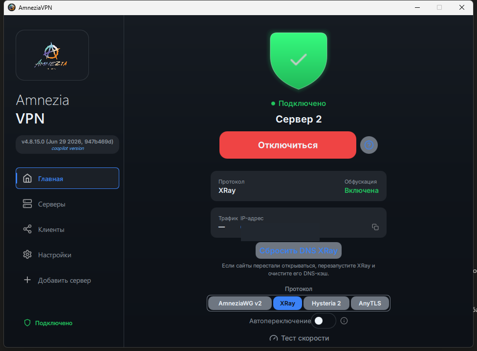
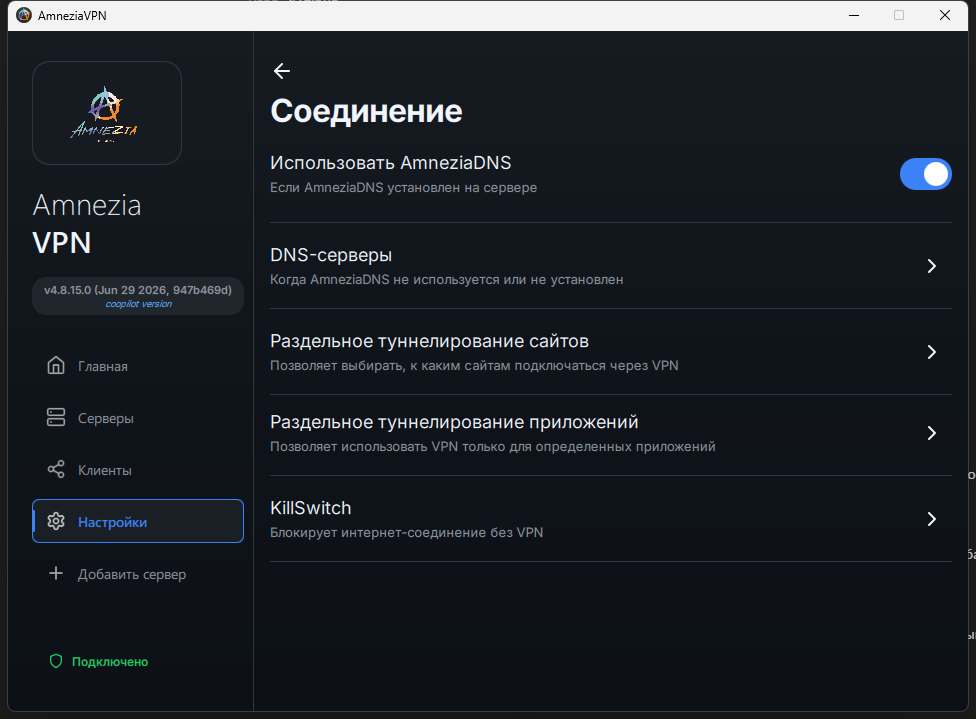
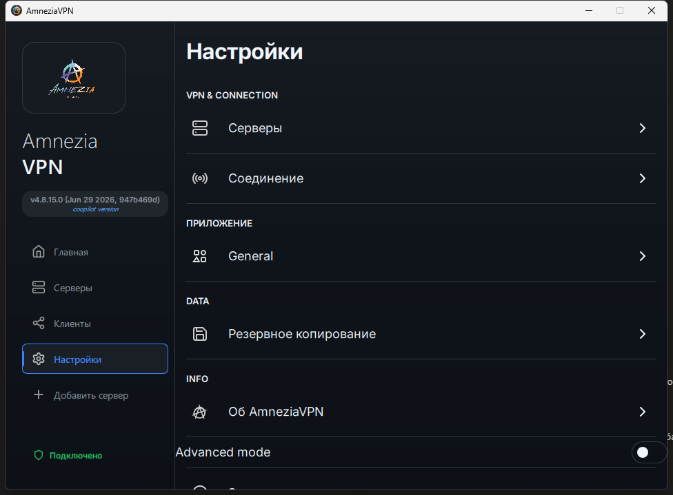

# SELFVPS

**Свой VPN, который продолжает работать там, где обычный уже не пробивается.**

Личная сборка на базе [AmneziaVPN](https://github.com/amnezia-vpn/amnezia-client) — для своего сервера, заточена под российские блокировки (в том числе на мобильном интернете).

---

> ⚠️ Неофициальный форк. Оригинал и все заслуги — команде **Amnezia**. Здесь только доработки поверх, «для себя».

## Что это и зачем

AmneziaVPN — отличный VPN для своего сервера. Но есть проблема: если IP твоего сервера уже «засветился» и попал под фильтры РКН, часть способов подключения начинает душиться — особенно на мобильном интернете, где фильтрация жёстче. Соединение то рвётся, то не открывает сайты.

**SELFVPS решает именно это.** Тут докручено ядро и маршрутизация так, чтобы туннель держался даже на «помеченном» сервере, а полезные мелочи (пустить одни приложения мимо VPN, оставить доступной домашнюю сеть) реально работали, а не были в списке для галочки.

## Что нового по сравнению с оригиналом

- 🛡 **Пробивает там, где раньше не пробивало.** Трафик маскируется под случайный шум — фильтрам не за что зацепиться. Работает даже на «засвеченном» IP.
- 🧩 **Раздельное туннелирование, которое работает.**
  - **По приложениям** — выбираешь из списка установленных, какие пустить мимо VPN. Теперь можно добавлять целыми папками, а список группируется и удаляется папкой.
  - **По сайтам** — российские сайты идут напрямую (быстрее), остальное через VPN. Настраивается один раз.
- 🏠 **Не отрубает локальную сеть.** Домашние устройства, принтер, роутер остаются доступны при включённом VPN.
- 📱 **Один сервер — все устройства.** Переустановка на сервере больше не ломает подключение на других телефонах/компьютерах.
- 🎯 **Честный индикатор** на главном экране: сразу видно, включена ли маскировка и какая именно.
- 🎛 **Расширенные настройки XRay** — маскировка, размер пакетов, MTU, скорость канала, буферы. Всё, что меняешь, уезжает и на сервер тоже, а не только в клиент. Есть кнопка «вернуть как было».
- 🗺 **Список российских IP теперь видно и можно настроить** — сколько подсетей загружено, когда обновлялся, откуда качается и как часто. Старый адрес списка давно умер (404) и обновления молча не работали — заменён на живой.
- 🎨 **Новый интерфейс** — тёмная тема, синий акцент, понятный индикатор соединения.
- 🔧 **Стабильнее служба и установщик** на Windows (убраны зависания подключения и «спотыкания» при переустановке).

## ⬇️ Скачать

Готовые файлы — на странице **[Releases](https://github.com/vovankrot/AmneziaSELFVPS/releases/latest)**:

| Что | Файл |
|-----|------|
| 🪟 Приложение для Windows | `AmneziaVPN_*_x64_setup.exe` |
| 🤖 Приложение для Android | `AmneziaVPN_*_android_*.apk` |
| 🧰 Build Studio (собрать самому) | `SelfvpsBuildStudio.exe` | ОБЯЗАТЕЛЬНО ПОЛОЖИ В ПАПКУ КУДА РАСПАКОВАЛ КОД С ГИТХАБА

## 🧰 Собрать самому — Build Studio

Если хочешь собрать из исходников, не разбираясь в тулчейнах — запусти **Build Studio** (`SelfvpsBuildStudio.exe`):

1. Выбери платформу — **Windows / macOS / Android / Linux**.
2. Studio сама проверит, что установлено, и **докачает недостающее**.
3. Нажми **Собрать** — получишь готовый файл.

Работает и на Windows, и на Linux. Подробности и ручная сборка — в **[SETUP.md](SETUP.md)**.

## 📡 Протоколы

**AmneziaWG** · **XRay** · **Hysteria2** · **AnyTLS** — с упором на те, что переживают жёсткую фильтрацию.

## 🙏 Оригинальный проект

Всё построено на **AmneziaVPN** — спасибо команде Amnezia:

- Клиент: **https://github.com/amnezia-vpn/amnezia-client**
- Сайт: **https://amnezia.org**
- Документация: **https://docs.amnezia.org**

Лицензия — **GPLv3** (как у оригинала).

## ⚠️ Дисклеймер

Неофициальная сборка для личного использования. На свой риск, только для законного обхода цензуры на **собственном** сервере.
