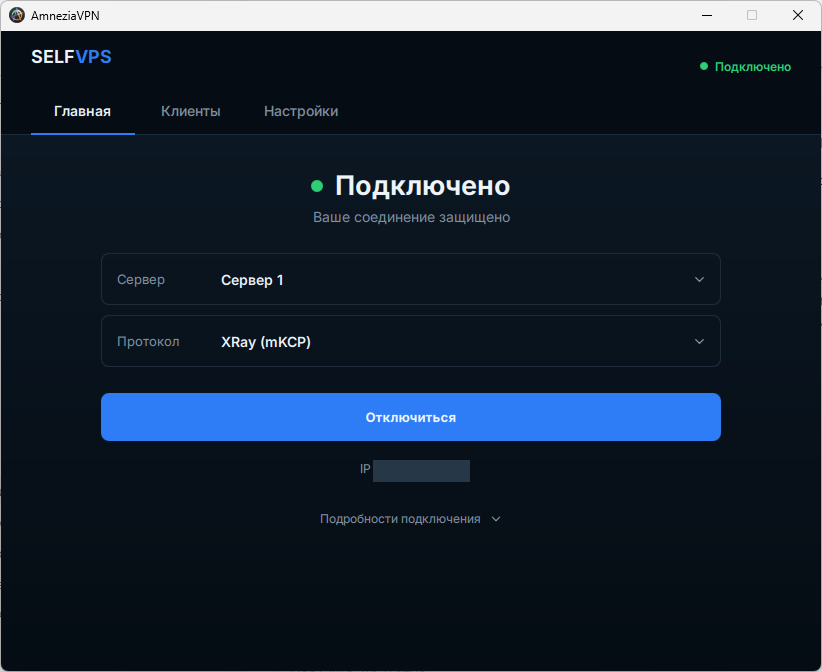
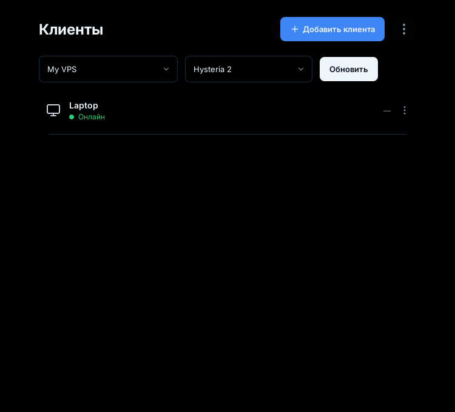
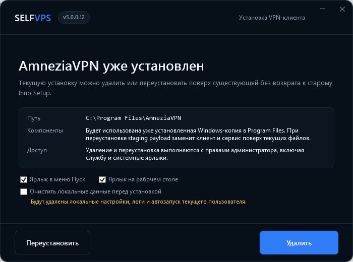
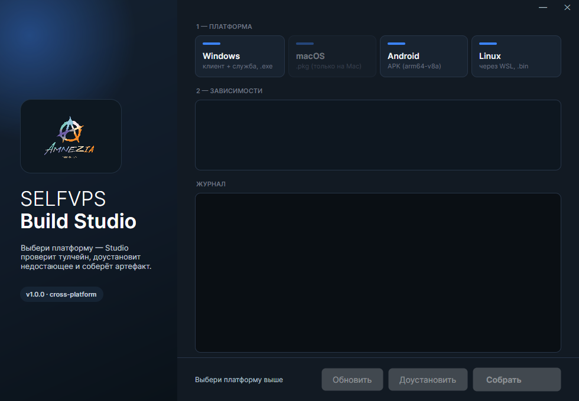

# SELFVPS

**Свой VPS, свои VPN-профили и управление клиентами в одном приложении.**

SELFVPS — неофициальный форк [AmneziaVPN](https://github.com/amnezia-vpn/amnezia-client) для работы с собственным сервером. В нём собраны AmneziaWG, XRay, Hysteria 2 и AnyTLS, переработанный настольный интерфейс, собственный установщик Windows и графический инструмент сборки Build Studio.

[**Скачать для Windows**](https://github.com/vovankrot/AmneziaSELFVPS/releases/latest) · [Изменения 5.0.0.12](docs/releases/5.0.0.12.md) · [Инструкция сборки](SETUP.md)

## Приложение

### Главная: подключение и выбор протокола

На главной видны состояние соединения, выбранный сервер и протокол. Переключение профилей, подключение и подробности соединения доступны с одного экрана.



### Клиенты: конфигурации и активность

Отдельная вкладка для выбора сервера и протокола, добавления клиентов и управления их конфигурациями. Список обновляется в фоне; состав доступных действий и статистики зависит от протокола и прав доступа к VPS.



### Что можно настроить

- **Протоколы:** AmneziaWG, XRay, Hysteria 2 с Salamander и AnyTLS; для XRay предусмотрены дополнительные варианты транспорта и маскировки.
- **Серверы и доступ:** управление протоколами на собственном VPS, создание и экспорт клиентских конфигураций, подтверждение SSH-ключа при первом подключении.
- **Маршрутизация:** раздельное туннелирование по приложениям и сайтам для поддерживаемых протоколов, DNS, Kill Switch и доступ к локальной сети.
- **Интерфейс:** русский и английский языки; настройки разделены на «Общие», «VPN и подключение», «Серверы» и «Обслуживание».
- **Обновления Windows:** проверка релизов этого репозитория при запуске и периодически. Загрузка и установка — по подтверждению пользователя; перед запуском проверяются размер и SHA-256 файла.
- **Обновление Hysteria на VPS:** проверка версии и контрольной суммы, журнал выполнения, проверка запуска и откат при ошибке.

> На скриншотах — работающие окна приложения, предоставленные пользователем. IP сервера и дата активности закрыты непрозрачными плашками; остальные элементы интерфейса сохранены.

## Установщик Windows

Собственный установщик устанавливает клиент, Windows-службу и сетевые компоненты. Если приложение уже установлено, доступны переустановка и удаление; очистка локальных данных вынесена в отдельный флажок. Обновление через клиент использует режим сохранения настроек.



Готовый **Windows x64 EXE**, контрольная сумма и манифест зависимостей находятся в [GitHub Releases](https://github.com/vovankrot/AmneziaSELFVPS/releases/latest). Установщик SELFVPS не подписан Authenticode; входящий драйвер раздельного туннелирования имеет отдельные подписи.

## Build Studio: сборка из исходников

Build Studio — графическая оболочка над сценариями сборки проекта. Выберите платформу, проверьте зависимости, при необходимости доустановите их и запустите сборку. Результаты проверки и журнал выводятся в том же окне.



Доступность целей зависит от компьютера: Windows может собирать Windows и Android, Linux — через WSL; macOS требует Mac. Наличие карточки платформы не означает, что для неё опубликован готовый пакет.

Для запуска Build Studio из исходников нужен .NET 8 SDK:

```powershell
dotnet run --project launcher/SelfvpsBuildStudio -c Release
```

Для упаковки самого Build Studio:

```powershell
.\launcher\publish.ps1 -Rid win-x64
# Результат: launcher/dist/SelfvpsBuildStudio.exe
```

По умолчанию опубликованной оболочке нужен .NET 8 runtime. Параметр `-SelfContained` включает его в пакет. Подготовка окружения и другие платформы описаны в [SETUP.md](SETUP.md).

## Сборка клиента

Клонируйте репозиторий вместе с подмодулями:

```sh
git clone --recurse-submodules https://github.com/vovankrot/AmneziaSELFVPS.git
cd AmneziaSELFVPS
```

Установите зависимости по [инструкции](SETUP.md) и запустите нужный сценарий:

```powershell
# Windows: клиент и установщик
.\build_installer.ps1 -SkipAndroidApk
# Android: APK из исходников
.\build_android.ps1
```

EXE/APK этих сценариев появляются в `dist/`. В текущем релизе опубликован установщик Windows x64; свежий Android APK в него не входит. Сценарии Linux и macOS доступны в исходниках — см. [SETUP.md](SETUP.md).

## Состояние проекта

Изменения, выполненные проверки и ограничения перечислены в [описании 5.0.0.12](docs/releases/5.0.0.12.md). Работоспособность зависит от сети, VPS и выбранного протокола.

Таймауты видеосегментов Rutube в исключённом из VPN Firefox пока **не считаются устранёнными**. При исключении приложений строгий Kill Switch для соответствующих протоколов отключается; интерфейс показывает предупреждение. Обновление клиента не обновляет автоматически серверные компоненты.

## Разработка

- [Зависимости и сборка](SETUP.md)
- [Структура репозитория и безопасная очистка](docs/repository-layout.md)
- [Правила участия](CONTRIBUTING.md)
- [Проверки интерфейса](tests/ui-regressions/README.md)
- [Проверки обработки отказов драйвера](tests/driver-regressions/README.md)
- [Поставляемые зависимости форка](deploy/prebuilt-selfvps/README.md)

Чтобы посмотреть накопившиеся временные файлы:

```powershell
.\tools\clean-workspace.ps1
```

Без параметров команда ничего не удаляет. Исходники, готовые релизы и локальные данные сохраняются при очистке.

## Лицензия и авторство

Основной проект разработан командой Amnezia. SELFVPS содержит изменения поверх AmneziaVPN и не является официальной сборкой команды.

См. [LICENSE](LICENSE), [THIRD_PARTY_LICENSES.md](THIRD_PARTY_LICENSES.md) и лицензии зависимостей.
